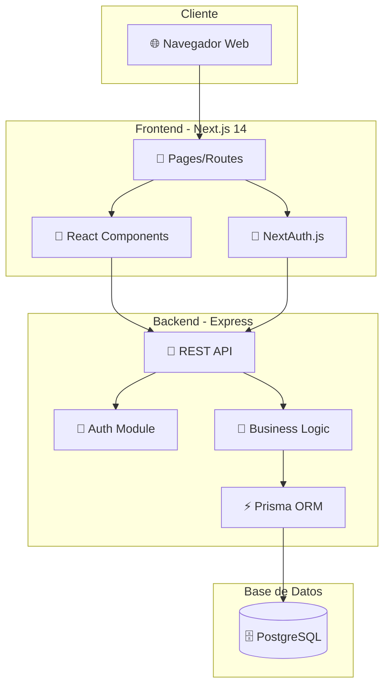

# 🏄 SurfSchool Booking Platform - clasedesurf.com

Plataforma completa de gestión de reservas para escuelas de surf, construida con arquitectura moderna y escalable. Diseñada para escuelas en Lima y el norte del Perú.

## 📋 Tabla de Contenidos

- [Características](#-características)
- [Estado del Proyecto (Diciembre 2025)](#-estado-del-proyecto-diciembre-2025)
- [Arquitectura del Sistema](#-arquitectura-del-sistema)
- [Stack Tecnológico](#-stack-tecnológico)
- [Puntos Fuertes y Mejoras](#-puntos-fuertes-y-puntos-de-mejora)
- [Instalación y Uso](#-instalación-y-uso)
- [Roadmap](#-roadmap)

## ✨ Características

### Para Estudiantes
- 🔐 **Registro y Autenticación**: Login seguro con JWT. Perfiles detallados (edad, peso, nivel).
- 📅 **Reserva de Clases**: Exploración por fecha, nivel y tipo.
- 💳 **Pagos Flexibles**: Soporte para Yape, Transferencia y efectivo con validación de vouchers.
- 📊 **Historial**: Seguimiento de clases pasadas y futuras.

### Para Administradores de Escuela
- 🏫 **Dashboard Completo**: Estadísticas en tiempo real de ingresos, reservas y ocupación.
- 📚 **Gestión de Clases Avanzada**: 
  - Creación y edición de horarios.
  - **Papelera de Reciclaje**: Sistema de "Soft Delete" para recuperar clases eliminadas.
  - **Duplicación**: Copia rápida de clases para semanas futuras.
- 📝 **Gestión de Reservas**:
  - Vista detallada con filtros potentes.
  - Manejo de estados (Pendiente, Confirmado, Pagado).
  - Visualización de comprobantes de pago.
- 👥 **Gestión de Estudiantes**: Base de datos de alumnos con historial médico y deportivo.

### Para Administradores del Sistema (Super Admin)
- 🏢 **Multi-tenancy**: Gestión centralizada de múltiples escuelas (ej. Lima, Máncora).
- 👨‍💼 **Control de Usuarios**: Gestión de roles y permisos globales.
- 💸 **Códigos de Descuento**: Sistema robusto de cupones (fijos/porcentaje) por escuela o globales.

## 📊 Estado del Proyecto (Diciembre 2025)

El proyecto se encuentra en una fase avanzada de desarrollo (**Fase 2 - Core Features Completada**), con un sistema completamente funcional para la operación diaria de escuelas de surf.

### ✅ Recientemente Implementado
- **Sistema de Soft Delete**: Las clases eliminadas van a una "papelera" y pueden restaurarse.
- **Rediseño de Gestión de Reservas**: Nueva UI con tarjetas de estadísticas, filtros avanzados y búsqueda en tiempo real.
- **Seed de Datos**: Script completo para poblar la base de datos con escenarios realistas de prueba.
- **Mejoras en UI/UX**: Uso de `lucide-react` para iconos consistentes y diseño responsive mejorado.

### 🚧 En Progreso
- Integración automatizada con pasarelas de pago (Stripe/Culqi).
- Sistema de notificaciones automáticas (Email/WhatsApp).

## 🏗 Arquitectura del Sistema

El sistema utiliza una arquitectura de **Frontend y Backend separados** para máxima escalabilidad.



## 🛠 Stack Tecnológico

### Frontend
- **Framework:** Next.js 14 (App Router)
- **Lenguaje:** TypeScript
- **UI Framework:** Tailwind CSS
- **Iconos:** Lucide React
- **Estado/Data Fetching:** React Hooks, Context API
- **Auth:** NextAuth.js

### Backend
- **Framework:** Express.js
- **Lenguaje:** TypeScript
- **ORM:** Prisma
- **Base de Datos:** PostgreSQL
- **Seguridad:** JWT, bcrypt, CORS
- **Validación:** Zod

## 💪 Puntos Fuertes y Puntos de Mejora

### ✅ Puntos Fuertes
1.  **Arquitectura Sólida**: Separación clara entre frontend y backend permite escalar equipos independientemente.
2.  **Seguridad de Datos**: Implementación de **Soft Delete** previene pérdida accidental de información crítica.
3.  **Experiencia de Usuario (UX)**: Interfaz moderna, rápida y responsive. El nuevo panel de reservas facilita la gestión diaria.
4.  **Multi-tenancy Nativo**: El sistema está diseñado desde el núcleo para soportar múltiples escuelas con datos aislados.
5.  **Type Safety**: Uso estricto de TypeScript en todo el stack reduce errores en tiempo de ejecución.

### 🔄 Puntos de Mejora (Roadmap)
1.  **Automatización de Pagos**: Actualmente la validación de pagos es manual (revisión de vouchers). Se necesita integrar API de bancos o pasarelas.
2.  **Notificaciones**: Falta implementar correos transaccionales (confirmación de reserva, recordatorios) y alertas por WhatsApp.
3.  **Testing E2E**: Aunque hay tests unitarios backend, falta cobertura completa End-to-End (Cypress/Playwright).
4.  **Optimización de Imágenes**: Implementar un servicio dedicado para optimización de carga de imágenes (actualmente se sirven estáticas/subidas).

## 🚀 Instalación y Uso

### Prerrequisitos
- Node.js 18+
- PostgreSQL

### Configuración Rápida

1.  **Clonar y configurar Backend**:
    ```bash
    cd backend
    npm install
    cp .env.example .env
    # Configurar DATABASE_URL en .env
    npx prisma migrate dev
    npm run seed # Carga datos de prueba completos
    npm run dev
    ```

2.  **Clonar y configurar Frontend**:
    ```bash
    cd frontend
    npm install
    cp .env.local.example .env.local
    # Configurar NEXT_PUBLIC_BACKEND_URL
    npm run dev
    ```

### Credenciales de Prueba (Seed)

| Rol | Email | Password |
|-----|-------|----------|
| **Admin Global** | admin@clasedesurf.com | password123 |
| **Escuela Lima** | admin@surfschoollima.com | password123 |
| **Escuela Máncora** | admin@mancorasurf.com | password123 |
| **Estudiante** | estudiante1@example.com | password123 |

## 🔮 Roadmap

### Q1 2026 - Automatización
- [ ] Integración Pasarela de Pagos
- [ ] Sistema de Notificaciones Email/Push

### Q2 2026 - Expansión
- [ ] App Móvil (React Native)
- [ ] Módulo de Inventario de Equipos

---
**Desarrollado para clasedesurf.com - Diciembre 2025**
