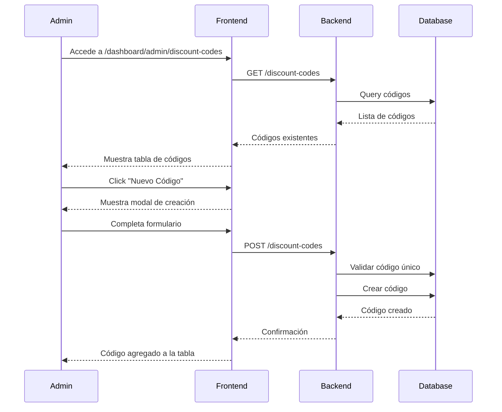
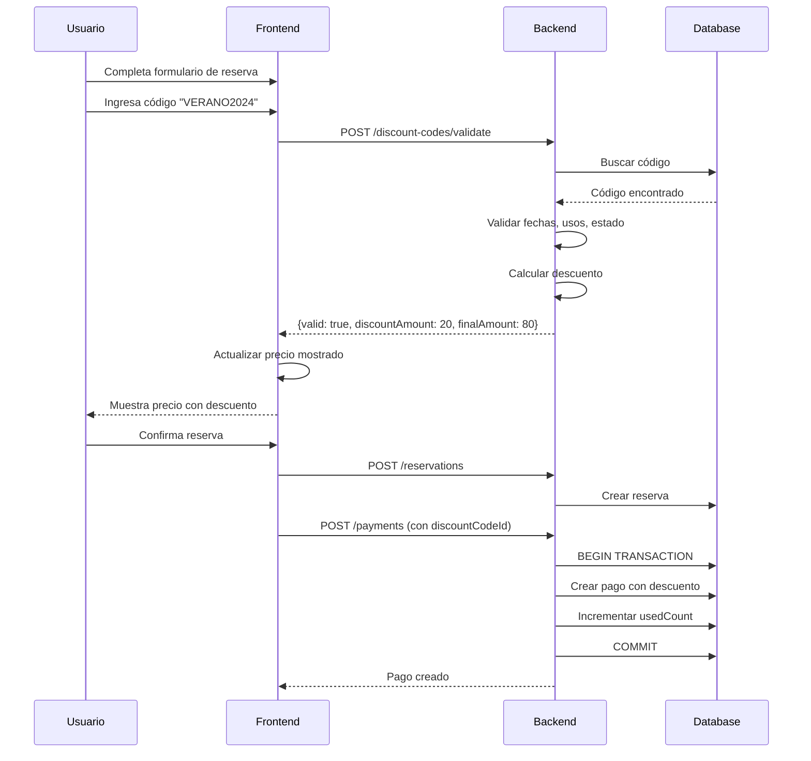

# 🎟️ Sistema de Códigos de Descuento - Clase de Surf

**Fecha de Implementación:** Diciembre 2024  
**Estado:** ✅ **Completamente Implementado y Funcional**

---

## 📋 TABLA DE CONTENIDOS

1. [Resumen](#resumen)
2. [Características](#características)
3. [Arquitectura](#arquitectura)
4. [Modelo de Datos](#modelo-de-datos)
5. [API Endpoints](#api-endpoints)
6. [Flujo de Uso](#flujo-de-uso)
7. [Configuración](#configuración)
8. [Ejemplos de Uso](#ejemplos-de-uso)

---

## 📝 RESUMEN

El sistema de códigos de descuento permite a los administradores (ADMIN y SCHOOL_ADMIN) crear códigos promocionales que los usuarios pueden aplicar durante el proceso de reserva para obtener descuentos porcentuales en el precio de las clases.

### Características Principales

- ✅ **Porcentaje de descuento variable** (0-100%)
- ✅ **Período de validez configurable** (fechas de inicio y fin)
- ✅ **Límite de usos opcional** (o ilimitado)
- ✅ **Códigos globales** (admin) o **específicos por escuela** (school_admin)
- ✅ **Validación automática** de códigos al aplicar
- ✅ **Actualización automática** del contador de usos
- ✅ **Integración completa** con el sistema de pagos

---

## ✨ CARACTERÍSTICAS

### Para Administradores

#### Creación de Códigos
- **Código único:** Letras, números, guiones y guiones bajos (mínimo 3 caracteres)
- **Porcentaje de descuento:** 0-100% configurable
- **Período de validez:** Fechas de inicio y fin personalizables
- **Límite de usos:** Opcional (puede ser ilimitado)
- **Alcance:** Global (admin) o específico por escuela (school_admin)
- **Estado:** Activo/Inactivo

#### Gestión de Códigos
- **Listado completo** con estado de validez
- **Edición** de códigos existentes
- **Eliminación** de códigos
- **Visualización de estadísticas:** Usos, límites, validez

### Para Usuarios

#### Aplicación de Códigos
- **Campo de código** en el proceso de reserva
- **Validación en tiempo real** al ingresar el código
- **Cálculo automático** del descuento
- **Visualización clara** del precio original, descuento y precio final
- **Mensajes informativos** sobre el estado del código

---

## 🏗️ ARQUITECTURA

### Backend

```
backend/
├── src/
│   ├── routes/
│   │   └── discountCodes.ts      # Rutas CRUD y validación
│   ├── validations/
│   │   └── discountCodes.ts      # Schemas Zod
│   └── prisma/
│       └── schema.prisma          # Modelo DiscountCode
```

### Frontend

```
frontend/
├── src/
│   ├── app/
│   │   ├── dashboard/
│   │   │   └── admin/
│   │   │       └── discount-codes/
│   │   │           └── page.tsx   # Gestión de códigos
│   │   └── api/
│   │       └── discount-codes/    # API proxy routes
│   └── components/
│       └── booking/
│           └── BookingModal.tsx   # Campo de código
```

---

## 💾 MODELO DE DATOS

### DiscountCode

```prisma
model DiscountCode {
  id                Int       @id @default(autoincrement())
  code              String    @unique
  description       String?
  discountPercentage Float    // Porcentaje de descuento (0-100)
  validFrom         DateTime  // Fecha de inicio de validez
  validTo           DateTime  // Fecha de fin de validez
  isActive          Boolean   @default(true)
  maxUses           Int?      // Número máximo de usos (null = ilimitado)
  usedCount         Int       @default(0)
  schoolId          Int?      // null = código global, número = código específico
  createdAt         DateTime  @default(now())
  updatedAt         DateTime  @updatedAt
  school            School?   @relation(fields: [schoolId], references: [id])
  payments          Payment[]
  
  @@map("discount_codes")
}
```

### Payment (Actualizado)

```prisma
model Payment {
  // ... campos existentes ...
  discountCodeId    Int?
  discountAmount    Float?
  originalAmount    Float?       // Monto original antes del descuento
  discountCode      DiscountCode? @relation(fields: [discountCodeId], references: [id])
  // ...
}
```

---

## 🔌 API ENDPOINTS

### Gestión de Códigos (Requiere Autenticación)

#### `GET /discount-codes`
Lista todos los códigos de descuento según el rol del usuario.

**Roles permitidos:** ADMIN, SCHOOL_ADMIN

**Respuesta:**
```json
[
  {
    "id": 1,
    "code": "VERANO2024",
    "description": "Descuento de verano",
    "discountPercentage": 20,
    "validFrom": "2024-12-01T00:00:00Z",
    "validTo": "2024-12-31T23:59:59Z",
    "isActive": true,
    "maxUses": 100,
    "usedCount": 15,
    "schoolId": null,
    "school": null,
    "createdAt": "2024-11-15T10:00:00Z"
  }
]
```

#### `GET /discount-codes/:id`
Obtiene un código de descuento específico con detalles.

#### `POST /discount-codes`
Crea un nuevo código de descuento.

**Body:**
```json
{
  "code": "VERANO2024",
  "description": "Descuento de verano 20%",
  "discountPercentage": 20,
  "validFrom": "2024-12-01T00:00:00Z",
  "validTo": "2024-12-31T23:59:59Z",
  "isActive": true,
  "maxUses": 100,
  "schoolId": null
}
```

#### `PUT /discount-codes/:id`
Actualiza un código de descuento existente.

#### `DELETE /discount-codes/:id`
Elimina un código de descuento.

### Validación de Códigos (Público)

#### `POST /discount-codes/validate`
Valida un código de descuento y calcula el descuento.

**Body:**
```json
{
  "code": "VERANO2024",
  "amount": 100,
  "classId": 1
}
```

**Respuesta (Válido):**
```json
{
  "valid": true,
  "discountCode": {
    "id": 1,
    "code": "VERANO2024",
    "description": "Descuento de verano",
    "discountPercentage": 20
  },
  "discountCodeId": 1,
  "originalAmount": 100,
  "discountAmount": 20,
  "finalAmount": 80
}
```

**Respuesta (Inválido):**
```json
{
  "valid": false,
  "message": "Este código de descuento ha expirado"
}
```

---

## 🔄 FLUJO DE USO

### 1. Crear Código de Descuento (Admin)



### 2. Aplicar Código en Reserva (Usuario)



---

## ⚙️ CONFIGURACIÓN

### Migración de Base de Datos

```bash
cd backend
npx prisma migrate dev --name add_discount_codes
npx prisma generate
```

### Variables de Entorno

No se requieren variables de entorno adicionales. El sistema utiliza la misma configuración del backend existente.

---

## 📖 EJEMPLOS DE USO

### Ejemplo 1: Código Global de Verano

**Creación:**
```json
POST /discount-codes
{
  "code": "VERANO2024",
  "description": "Descuento de verano 20%",
  "discountPercentage": 20,
  "validFrom": "2024-12-01T00:00:00Z",
  "validTo": "2024-12-31T23:59:59Z",
  "isActive": true,
  "maxUses": 100,
  "schoolId": null
}
```

**Resultado:**
- Código válido para todas las escuelas
- 20% de descuento
- Válido durante diciembre 2024
- Máximo 100 usos

### Ejemplo 2: Código Específico de Escuela

**Creación:**
```json
POST /discount-codes
{
  "code": "ESCUELA1-50",
  "description": "Descuento especial escuela 1",
  "discountPercentage": 50,
  "validFrom": "2024-12-01T00:00:00Z",
  "validTo": "2024-12-15T23:59:59Z",
  "isActive": true,
  "maxUses": null,
  "schoolId": 1
}
```

**Resultado:**
- Código válido solo para escuela con ID 1
- 50% de descuento
- Válido del 1 al 15 de diciembre
- Usos ilimitados

### Ejemplo 3: Aplicar Código en Reserva

**Precio original:** S/ 100 (PEN)

**Código aplicado:** VERANO2024 (20% descuento)

**Cálculo:**
- Descuento: S/ 20 (20% de S/ 100)
- Precio final: S/ 80

**Visualización en UI:**
```
Subtotal (1 persona): S/ 100
Descuento: -S/ 20
─────────────────────
Total a pagar: S/ 80
```

---

## 🔒 VALIDACIONES Y SEGURIDAD

### Validaciones Implementadas

1. **Código único:** No puede haber dos códigos con el mismo nombre
2. **Formato de código:** Solo letras, números, guiones y guiones bajos
3. **Porcentaje:** Debe estar entre 0 y 100
4. **Fechas:** `validTo` debe ser posterior a `validFrom`
5. **Límite de usos:** Si existe, debe ser mayor a 0
6. **Estado activo:** Solo códigos activos pueden aplicarse
7. **Validez temporal:** Solo códigos dentro de su período de validez
8. **Límite de usos:** No puede exceder `maxUses` si está definido
9. **Escuela específica:** Si el código es de una escuela, solo aplica a clases de esa escuela

### Seguridad

- ✅ **Autenticación requerida** para gestión de códigos
- ✅ **Autorización por roles** (ADMIN, SCHOOL_ADMIN)
- ✅ **Validación de datos** con Zod schemas
- ✅ **Transacciones atómicas** al aplicar descuentos
- ✅ **Validación en tiempo real** antes de aplicar
- ✅ **Aislamiento multi-tenant** para school_admin

---

## 📊 ESTADÍSTICAS Y REPORTES

### Información Disponible

- **Usos totales:** `usedCount`
- **Usos restantes:** `maxUses - usedCount` (si aplica)
- **Estado de validez:** Calculado en tiempo real
- **Historial de pagos:** Relación con Payment

### Visualización en Dashboard

El dashboard de admin muestra:
- Lista completa de códigos
- Estado de validez (Válido/Inválido)
- Porcentaje de descuento
- Período de validez
- Usos actuales vs. máximo
- Escuela asociada (si aplica)

---

## 🐛 TROUBLESHOOTING

### Problemas Comunes

#### 1. Código no se aplica
- Verificar que el código esté activo (`isActive: true`)
- Verificar que esté dentro del período de validez
- Verificar que no haya excedido el límite de usos
- Verificar que el código sea válido para la escuela de la clase

#### 2. Error al crear código
- Verificar que el código sea único
- Verificar el formato del código (solo letras, números, guiones, guiones bajos)
- Verificar que las fechas sean válidas

#### 3. Descuento no se calcula correctamente
- Verificar que el porcentaje esté entre 0 y 100
- Verificar que el monto original sea correcto
- Revisar logs del backend para errores de cálculo

---

## 🚀 PRÓXIMAS MEJORAS

### Funcionalidades Futuras

- [ ] **Códigos de descuento por primera compra**
- [ ] **Descuentos por volumen** (múltiples clases)
- [ ] **Códigos de referido** (descuento para referidor y referido)
- [ ] **Descuentos automáticos** por temporada
- [ ] **Notificaciones** cuando un código está por expirar
- [ ] **Reportes de uso** de códigos
- [ ] **Exportación** de estadísticas de códigos

---

## 📚 REFERENCIAS

- [Documentación de Prisma](https://www.prisma.io/docs)
- [Documentación de Zod](https://zod.dev/)
- [Documentación de Express](https://expressjs.com/)

---

**Última actualización:** Diciembre 2024  
**Versión:** 1.0.0


