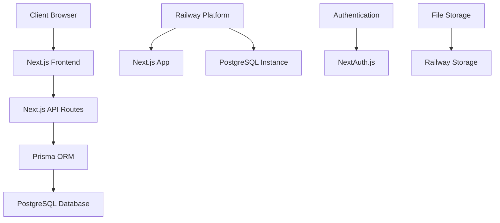

# Design Document

## Overview

La SurfSchool Booking Platform es una aplicación web full-stack construida con Next.js 14 que utiliza el App Router para una arquitectura moderna y escalable. El sistema implementa una arquitectura de tres capas: presentación (React components), lógica de negocio (API Routes), y persistencia (PostgreSQL con Prisma ORM). La aplicación está diseñada para ser desplegada en Railway con una base de datos PostgreSQL gestionada.

## Architecture

### High-Level Architecture



### Technology Stack

- **Frontend**: Next.js 14 with App Router, React 18, TypeScript
- **Backend**: Next.js API Routes, NextAuth.js for authentication
- **Database**: PostgreSQL with Prisma ORM
- **Deployment**: Railway platform
- **Styling**: Tailwind CSS (recommended for rapid development)
- **Validation**: Zod for runtime type checking

### Folder Structure

```
src/
├── app/
│   ├── (auth)/
│   │   ├── login/
│   │   └── register/
│   ├── dashboard/
│   │   ├── admin/
│   │   └── student/
│   ├── classes/
│   ├── reservations/
│   └── api/
│       ├── auth/
│       ├── classes/
│       ├── reservations/
│       ├── payments/
│       └── users/
├── components/
│   ├── ui/
│   ├── forms/
│   └── dashboard/
├── lib/
│   ├── prisma.ts
│   ├── auth.ts
│   └── validations.ts
└── types/
    └── index.ts
```

## Components and Interfaces

### Core Data Models

```typescript
// User Profile Interface
interface UserProfile {
  id: number;
  name: string;
  email: string;
  age?: number;
  weight?: number;
  height?: number;
  canSwim: boolean;
  injuries?: string;
  role: 'student' | 'admin' | 'school_owner';
}

// Class Interface
interface SurfClass {
  id: number;
  date: Date;
  capacity: number;
  availableSpots: number;
  school: School;
  instructor?: string;
  level: 'beginner' | 'intermediate' | 'advanced';
  price: number;
}

// Reservation Interface
interface Reservation {
  id: number;
  user: UserProfile;
  class: SurfClass;
  status: 'pending' | 'paid' | 'canceled';
  specialRequest?: string;
  createdAt: Date;
  payment?: Payment;
}

// Payment Interface
interface Payment {
  id: number;
  reservationId: number;
  amount: number;
  status: 'unpaid' | 'paid' | 'refunded';
  paymentMethod?: string;
  transactionId?: string;
  createdAt: Date;
}
```

### API Endpoints Design

#### Authentication Endpoints
- `POST /api/auth/register` - User registration
- `POST /api/auth/login` - User login
- `GET /api/auth/session` - Get current session
- `POST /api/auth/logout` - User logout

#### User Management
- `GET /api/users/profile` - Get user profile
- `PUT /api/users/profile` - Update user profile
- `GET /api/users/reservations` - Get user's reservations

#### Classes Management
- `GET /api/classes` - List available classes (with filters)
- `GET /api/classes/[id]` - Get specific class details
- `POST /api/classes` - Create new class (admin only)
- `PUT /api/classes/[id]` - Update class (admin only)
- `DELETE /api/classes/[id]` - Cancel class (admin only)

#### Reservations Management
- `POST /api/reservations` - Create new reservation
- `GET /api/reservations` - List reservations (filtered by user/admin)
- `PUT /api/reservations/[id]` - Update reservation status
- `DELETE /api/reservations/[id]` - Cancel reservation

#### Payments Management
- `POST /api/payments` - Record payment
- `GET /api/payments` - List payments (admin only)
- `PUT /api/payments/[id]` - Update payment status

#### Reports and Analytics
- `GET /api/reports/reservations` - Reservations report
- `GET /api/reports/payments` - Payments report
- `GET /api/reports/analytics` - Business analytics

### Frontend Components Architecture

#### Page Components
- `LoginPage` - User authentication
- `RegisterPage` - User registration
- `StudentDashboard` - Student's main interface
- `AdminDashboard` - Administrator interface
- `ClassesPage` - Browse and select classes
- `ReservationForm` - Create new reservation
- `ProfilePage` - Manage user profile

#### Reusable Components
- `ClassCard` - Display class information
- `ReservationCard` - Display reservation details
- `PaymentStatus` - Show payment status
- `Calendar` - Class selection calendar
- `DataTable` - Admin data tables
- `StatusBadge` - Status indicators

## Data Models

### Enhanced Prisma Schema

```prisma
model User {
  id           Int           @id @default(autoincrement())
  name         String
  email        String        @unique
  password     String
  age          Int?
  weight       Float?
  height       Float?
  canSwim      Boolean       @default(false)
  injuries     String?
  role         Role          @default(STUDENT)
  createdAt    DateTime      @default(now())
  updatedAt    DateTime      @updatedAt
  reservations Reservation[]
  
  @@map("users")
}

model School {
  id          Int     @id @default(autoincrement())
  name        String
  location    String
  description String?
  email       String  @unique
  phone       String?
  isActive    Boolean @default(true)
  createdAt   DateTime @default(now())
  classes     Class[]
  
  @@map("schools")
}

model Class {
  id           Int           @id @default(autoincrement())
  date         DateTime
  capacity     Int
  instructor   String?
  level        Level         @default(BEGINNER)
  price        Float
  description  String?
  school       School        @relation(fields: [schoolId], references: [id])
  schoolId     Int
  isActive     Boolean       @default(true)
  createdAt    DateTime      @default(now())
  reservations Reservation[]
  
  @@map("classes")
}

model Reservation {
  id             Int      @id @default(autoincrement())
  user           User     @relation(fields: [userId], references: [id])
  userId         Int
  class          Class    @relation(fields: [classId], references: [id])
  classId        Int
  status         ReservationStatus @default(PENDING)
  specialRequest String?
  createdAt      DateTime @default(now())
  updatedAt      DateTime @updatedAt
  payment        Payment?
  
  @@map("reservations")
}

model Payment {
  id            Int           @id @default(autoincrement())
  reservation   Reservation   @relation(fields: [reservationId], references: [id])
  reservationId Int           @unique
  amount        Float
  status        PaymentStatus @default(UNPAID)
  paymentMethod String?
  transactionId String?
  createdAt     DateTime      @default(now())
  updatedAt     DateTime      @updatedAt
  
  @@map("payments")
}

enum Role {
  STUDENT
  ADMIN
  SCHOOL_OWNER
}

enum Level {
  BEGINNER
  INTERMEDIATE
  ADVANCED
}

enum ReservationStatus {
  PENDING
  PAID
  CANCELED
}

enum PaymentStatus {
  UNPAID
  PAID
  REFUNDED
}
```

## Error Handling

### API Error Response Format

```typescript
interface APIError {
  error: string;
  message: string;
  statusCode: number;
  details?: any;
}
```

### Error Handling Strategy

1. **Validation Errors**: Use Zod schemas for request validation
2. **Database Errors**: Catch Prisma errors and return appropriate HTTP status
3. **Authentication Errors**: Handle unauthorized access with proper redirects
4. **Business Logic Errors**: Custom error classes for domain-specific errors

### Error Categories

- **400 Bad Request**: Invalid input data
- **401 Unauthorized**: Authentication required
- **403 Forbidden**: Insufficient permissions
- **404 Not Found**: Resource not found
- **409 Conflict**: Business rule violation (e.g., class full)
- **500 Internal Server Error**: Unexpected server errors

## Testing Strategy

### Unit Testing
- **Components**: React Testing Library for component testing
- **API Routes**: Jest for API endpoint testing
- **Business Logic**: Unit tests for utility functions
- **Database**: Prisma testing with test database

### Integration Testing
- **API Integration**: Test complete request/response cycles
- **Database Integration**: Test Prisma operations
- **Authentication Flow**: Test NextAuth.js integration

### End-to-End Testing
- **User Flows**: Playwright for critical user journeys
- **Reservation Process**: Complete booking flow testing
- **Admin Operations**: Administrative task testing

### Testing Structure

```
tests/
├── unit/
│   ├── components/
│   ├── api/
│   └── utils/
├── integration/
│   ├── api/
│   └── database/
└── e2e/
    ├── user-flows/
    └── admin-flows/
```

## Security Considerations

### Authentication & Authorization
- NextAuth.js for secure session management
- Role-based access control (RBAC)
- JWT tokens for API authentication
- Password hashing with bcrypt

### Data Protection
- Input validation and sanitization
- SQL injection prevention through Prisma
- XSS protection with proper escaping
- CSRF protection with NextAuth.js

### API Security
- Rate limiting for API endpoints
- Request size limits
- CORS configuration
- Environment variable protection

## Performance Optimization

### Database Optimization
- Proper indexing on frequently queried fields
- Connection pooling with Prisma
- Query optimization for complex joins
- Database migrations strategy

### Frontend Optimization
- Next.js Image optimization
- Code splitting and lazy loading
- Static generation where possible
- Client-side caching strategies

### Caching Strategy
- Server-side caching for class listings
- Client-side state management
- CDN for static assets
- Database query caching

## Deployment Architecture

### Railway Configuration
- Environment variables management
- Database connection configuration
- Build and deployment pipeline
- Health checks and monitoring

### Environment Setup
```bash
# Required Environment Variables
DATABASE_URL="postgresql://..."
NEXTAUTH_SECRET="..."
NEXTAUTH_URL="https://your-app.railway.app"
```

### Scalability Considerations
- Horizontal scaling preparation
- Database connection limits
- File upload handling
- Multi-school data isolation

This design provides a solid foundation for implementing the SurfSchool Booking Platform with modern web development practices, proper security measures, and scalability for future marketplace expansion.